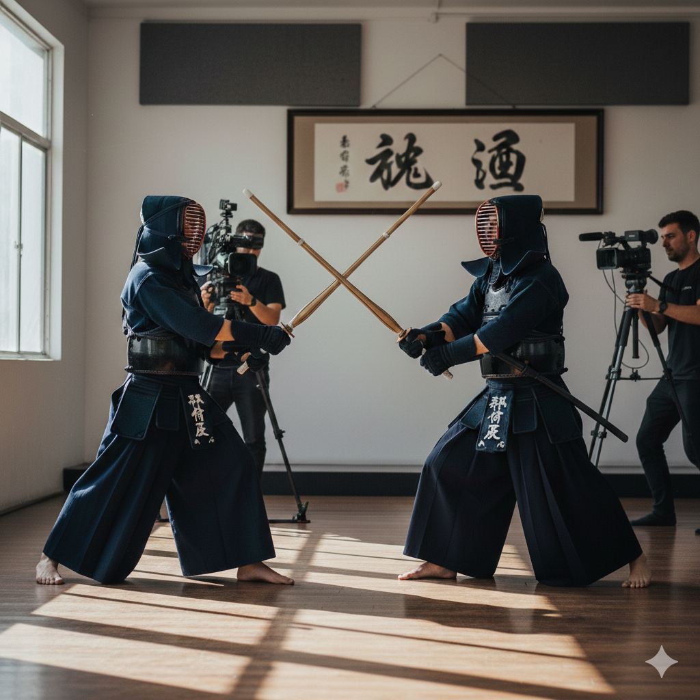
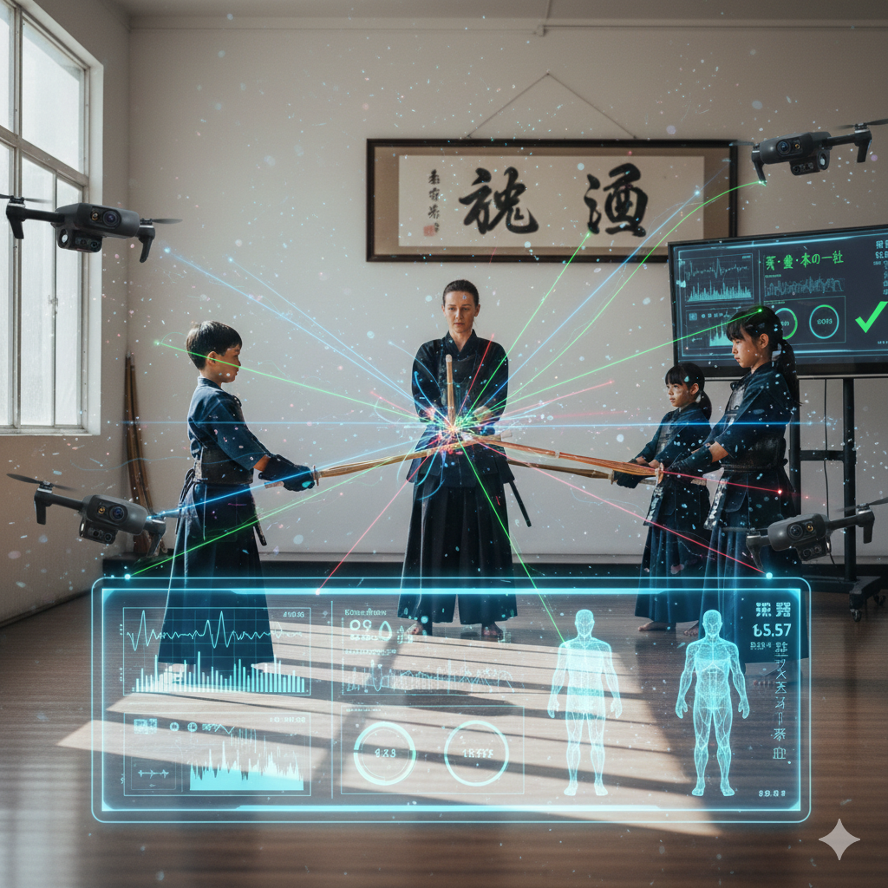
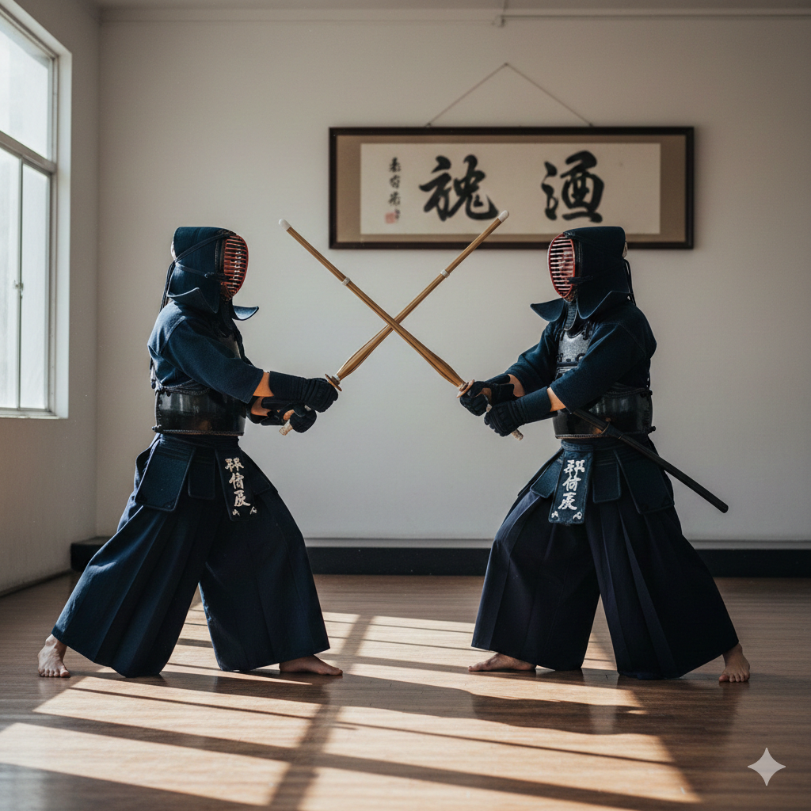

# Metsuke-Core
## 剣道の「気・剣・体」を“測れる”トレーニングシステム（PCベース高精度解析）

- SIer提案：道場導入〜運用までワンストップ
- 目的：フォーム改善・再現性向上・指導の標準化

![道場で計測している写真]

---

# 本日のゴール

1. なぜ「可視化」が剣道の上達速度を上げるのか
2. Metsuke-Coreの計測思想（気・剣・体の分解）
3. 構成（BOM）とデータフロー
4. 導入ステップ、運用イメージ、費用感（目安）
5. 次アクション（PoC/デモ）

---

# 課題認識（現場で起きていること）

- 指導が「感覚語」に寄りやすい（速い、冴えてる、合ってる等）
- 撮影動画はあるが、定量指標（速度・軌道・タイミング）がない
- 反復練習のPDCAが遅い（“何を変えたら良くなったか”が曖昧）
- 競技者のレベル差で指導内容が属人化する

![課題イメージ（動画とメモ、指導の様子）]

---

# 解決方針：気・剣・体を物理量へ分解

- 体：踏み込み、重心、関節の連動（時間・位置・速度）
- 剣：竹刀の先端／鍔元の軌道、速度、加速度（3D）
- 気：ここでは「発声」そのものより、**打突のタイミング整合**（同期）を評価対象にする  
  - 音（打突音／踏み込み音）＋剣のピーク＋体のピークを同一時刻系で評価

---

# Metsuke-Coreの提供価値（導入効果）

- コーチングの“根拠”が残る：指導の再現性・標準化
- 改善サイクルが早い：練習中に数値フィードバック
- 個別最適：選手ごとの癖（間合い・踏み込み・手の内）を定量比較
- チーム運用：成長ログ（時系列）で強化計画に直結

![ダッシュボード例（速度、軌道、同期）]

---

# システム全体像（要約）

- 高速IRカメラ（複数）で3D軌道追跡（竹刀＋身体マーカー）
- IMU（慣性計測）で打突瞬間の衝撃・回旋を補完
- 音響/振動で踏み込み・打突のピークを抽出
- ハードトリガーで全デバイス時間同期 → センサーフュージョン（カルマン等）

---

# BOM（1）ビジョンシステム：3D軌道追跡

目的：3次元空間における竹刀・身体の軌道追跡、間合いの計測。

| コンポーネント | 推奨仕様・技術要件 | 具体的な役割・選定理由 |
| --- | --- | --- |
| 産業用カメラ | Global Shutter／Monochrome Sensor: Sony Pregius（IMX273等） FPS: 200fps以上／I/F: USB3.0 Vision or GigE Vision | 高速移動する竹刀を歪みなく撮影。高感度モノクロで反射点を確実に捉える。 |
| レンズ | Cマウント固定焦点／低歪曲／マニュアルアイリス | ズームは振動で画角変化し不適。絞り固定で再現性を確保。 |
| 光学フィルター | IR Bandpass／Visible Cut 波長: 850nm or 940nm | 可視光ノイズを排除し、反射点のみを強調。 |
| 照明 | High-Power NIR LED Ring／波長一致／ストロボ同期 | 再帰反射を最大化。露光時間のみ発光し光量と省電力を両立。 |
| マーカー | 再帰性反射テープ／マーカー球 | 竹刀先端・鍔元・関節を「点」として高精度追跡。 |

---

# BOM（2）信号・物理センサー：冴え・音・同期

目的：映像では捉えきれない「衝撃（冴え）」「音」「同期」の計測。

| コンポーネント | 推奨仕様・技術要件 | 具体的な役割・選定理由 |
| --- | --- | --- |
| IMU（慣性計測） | 6/9軸（Acc+Gyro）／±16G〜±32G／1kHz以上 | 竹刀鍔内または手首。急減速（Jerk）と回旋（スナップ）を計測し映像を補間。 |
| 音響／振動センサー | ピエゾ／コンタクトマイク／指向性マイク | 踏み込み音・打突音のピーク取得。「気剣体一致」の時間差評価に使用。 |
| ハードウェアトリガー | GPIO／トリガーボックス／TTL(5V/3.3V) | マルチカメラ・センサーの時間軸を物理同期。精度の土台。 |

---

# BOM（3）計算インフラ：取り込みとリアルタイム処理

目的：膨大な生データの取り込みとリアルタイム処理。

| コンポーネント | 推奨仕様・技術要件 | 具体的な役割・選定理由 |
| --- | --- | --- |
| ホストPC | CPU: 高クロック（Core i7／Ryzen7以上） GPU: NVIDIA RTX 3060以上（CUDA） OS: Ubuntu or Windows | 画像取り込み割り込み＋3D再構成＋フィルター処理（行列演算）。 |
| インターフェイス | 独立コントローラー搭載USB／PCIeカード（例: ADLINK等） | 複数カメラの高帯域同時入力でもドロップしない設計。 |
| ストレージ | NVMe SSD（Gen4／Gen5）／1TB以上 | Raw録画の連続書込み（数百MB〜GB/s）に耐える。 |

---

# データフロー

graph LR
  subgraph Measurement
    S1["Sync Generation"]
    S2["IR Cameras"]
    S3["IMU + Audio"]
    S1 --> S2
    S1 -.-> S3
  end
  subgraph Analysis
    P["Sensor Fusion (CV + Signal)"]
    S2 --> P
    S3 --> P
  end
  subgraph Output
    O["Kinematic Analysis"]
    P --> O
  end

